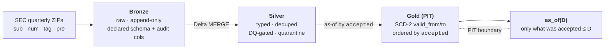

# VANTAGE

A point-in-time-correct financial-fundamentals lakehouse over the SEC Financial
Statement Data Sets. Scala 2.12 / Spark 3.5 / Delta 3.x.

**The load-bearing property:** a query for *fundamentals as of date D* returns only
what was **filed and accepted on or before D** — no lookahead, including across
restatements. A later correction to a prior period never leaks backward into an
as-of-D answer.

The name is the property, not an acronym: a *vantage point* can't see past the
horizon of D.

## Architecture

A three-layer medallion. The point-in-time boundary lives in the Gold layer, where
validity intervals are ordered strictly by the SEC `accepted` timestamp.



All transforms are pure `(DataFrame) => DataFrame`, so they unit-test without a cluster.

## Two guards

- **Content-addressed batch identity.** Each batch carries a `_batch_id` that is a
  SHA-256 over the source bytes **and** the schema version, code SHA, and ingest
  params — the input *and* the decision that produced the output. Any historical
  table state is reconstructable from that hash: identity is the hash, and Delta
  time-travel is the **retrieval** mechanism. (Retrieval, not byte-for-byte replay.)

- **Fail-closed-on-unevaluable DQ gate.** The gate denies not only when a constraint
  is *violated*, but when a constraint *cannot be evaluated* — a missing or
  wrong-typed column, an analyzer error, or empty input where rows are expected. A
  green result on an unevaluable check is the silent-verification failure mode the
  gate exists to prevent; such batches are quarantined, never written.

## Provenance posture

**Tamper-evident, not signed.** Provenance stops at hash + Delta time-travel —
hash-anchored and replayable. There is no attestation layer, by deliberate choice:
the authority for "what was true as of D" is the external timestamp the SEC issues,
not a reviewer's signature.

## Properties under test

The guarantees are pinned by property tests, not prose:

| Property | Test |
|---|---|
| Byte change ⇒ new batch id; recorded Delta version retrieves the original rows | `BatchIdSpec` (§5) |
| Gate returns `Unevaluable` on missing column / empty input; `Fail` on a violation | `DataQualityGateSpec` (§6) |
| `as_of(D)` returns the original value for `T1 ≤ D < T2`, the restated value for `D ≥ T2` | `PitNoLookaheadSpec` (§7) |
| The Gold temporal model is order-invariant (ingest order cannot change the Gold table) | `PitNoLookaheadSpec` (§7) |

## Build & test

```bash
sbt test       # unit transforms + the §5 / §6 / §7 property tests
sbt assembly   # fat jar -> target/scala-2.12/vantage-assembly-*.jar
```

Requires JDK 17 and Spark 3.5's Hadoop runtime. On Windows, set `HADOOP_HOME` to a
directory containing `winutils.exe` + `hadoop.dll`.

## Run

```bash
PIT_SOURCE_DIR=./data/2023q2 \
PIT_BRONZE_ROOT=./lake/bronze PIT_SILVER_ROOT=./lake/silver \
PIT_GOLD_ROOT=./lake/gold PIT_QUARANTINE_ROOT=./lake/quarantine \
PIT_REGISTRY_PATH=./lake/registry \
spark-submit --class pit.Pipeline target/scala-2.12/vantage-assembly-*.jar
```

## Limits

- Quarterly batch ingest; no streaming.
- US-GAAP / XBRL scope; no IFRS or non-XBRL filers.
- Tamper-evident, not attested — provenance stops at hash + time-travel, by design.

## Status

Early build. The architecture and property-test contracts above are defined; the
full pipeline and its test gate are still being brought to green. Claims here are
kept at or behind what the tests prove.
