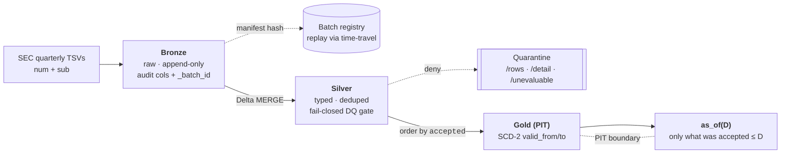

# VANTAGE

A point-in-time-correct financial-fundamentals lakehouse over the SEC Financial
Statement Data Sets. One source tree, two build profiles: Scala 2.12 / Spark 3.5 /
Delta 3.x (local + tests) and Scala 2.13 / Databricks Connect 17.3 (serverless
Databricks jobs).

**The load-bearing property:** a query for *fundamentals as of date D* returns only
what was **filed and accepted on or before D** — no lookahead, including across
restatements. A later correction to a prior period never leaks backward into an
as-of-D answer.

**Scope:** entity-level (consolidated, no-coregistrant) facts, within which the
natural key `(adsh, tag, version, ddate, qtrs, uom)` is unique — measured, not
assumed, across every published FSDS quarter; quarters where that fails are refused
whole by the DQ gate ([docs/SYSTEM.md](docs/SYSTEM.md)).

The name is the property, not an acronym: a *vantage point* can't see past the
horizon of D.

## How

A three-layer medallion whose point-in-time boundary lives in Gold: validity
intervals ordered strictly by the SEC `accepted` timestamp, never ingest order.



Two guards hold the property up: **content-addressed batch identity** (a batch id is
a SHA-256 over source bytes + schema version + code SHA + params, registered so any
historical state is retrievable via Delta time-travel) and a **fail-closed DQ gate**
(a constraint that *cannot be evaluated* denies, same as one that is violated —
unevaluable never collapses into a pass). The full enforcement story, the
properties-under-test table, and the stated limits: [docs/SYSTEM.md](docs/SYSTEM.md).

## Quick start

```bash
sbt test                  # the property suite (2.12 profile)
sbt assembly              # classic fat jar -> target/scala-2.12/
sbt "++2.13.16 assembly"  # serverless jar  -> target/scala-2.13/
```

Two-step run — `pit.Pipeline` per quarter through silver, then one
`pit.gold.GoldRebuild` pass. Config is the PIT_* contract, as env vars or as
`KEY=VALUE` program args (the serverless form). Commands, Windows setup, and the
Databricks bundle: [docs/DEVELOPMENT.md](docs/DEVELOPMENT.md).

## Status

**40 tests green in CI · full 2009→present history published locally (63/69
quarters ingested, 6 refused fail-closed with recomputed causes) · deployed and
published on Databricks serverless, publish verified under a three-part
write-audit-publish rule (2026-07-19).** The dated state of record is
[docs/STATUS.md](docs/STATUS.md); per-quarter backfill metrics are in
[docs/BACKFILL-METRICS.md](docs/BACKFILL-METRICS.md); the publish-verification
record with verbatim outputs is
[docs/GATE-B-WAP-EVIDENCE.md](docs/GATE-B-WAP-EVIDENCE.md).

Claims here are kept at or behind what the tests and the real runs prove.

## Docs

[docs/README.md](docs/README.md) is the index: what is authoritative
([SYSTEM](docs/SYSTEM.md) · [STATUS](docs/STATUS.md) ·
[DEVELOPMENT](docs/DEVELOPMENT.md)) and what is a point-in-time record.
