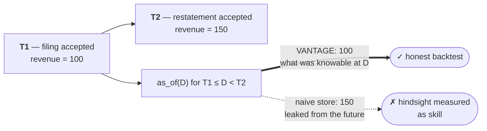
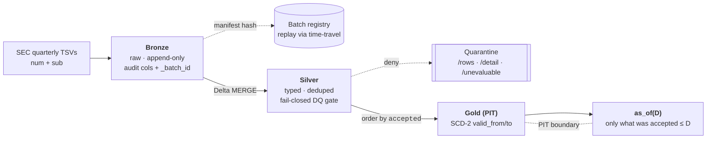
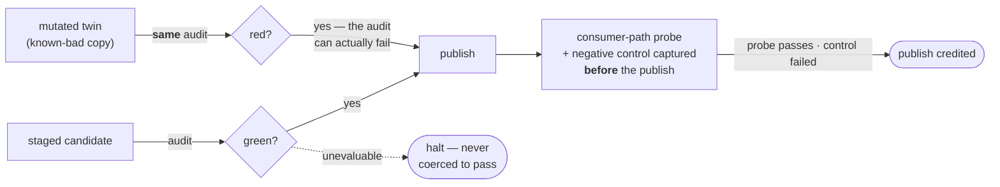

# VANTAGE

**A point-in-time-correct financial-fundamentals lakehouse over the SEC Financial
Statement Data Sets** — built so that *"what did we know on date D?"* has exactly one
answer, and that answer never quietly changes.

[](https://github.com/hossainpazooki/pit-fundamentals-lakehouse/actions/workflows/ci.yml)


One source tree, two build profiles: Scala 2.12 / classic Spark (local + the test
suite) and Scala 2.13 / Databricks Connect (serverless Databricks jobs).

## Why

Companies restate their filings. When they do, most datasets silently overwrite the
old value — and every backtest, model feature, or risk figure computed "as of" an
earlier date is now computed with information nobody had on that date. That is
**lookahead**: it inflates backtests, contaminates training data, and is invisible
after the fact because the corrupted answer *looks* plausible.



**The load-bearing property:** a query for *fundamentals as of date D* returns only
what was **filed and accepted on or before D** — no lookahead, including across
restatements. A later correction never leaks backward into an as-of-D answer.

**Who it's for:** anyone whose numbers must be defensible *as of a date* — quant
research and backtesting, ML feature stores over fundamentals, audit and
compliance reporting — and engineers who want a worked example of
verification-first data engineering.

The name is the property, not an acronym: a *vantage point* can't see past the
horizon of D.

## How

A three-layer medallion whose point-in-time boundary lives in Gold: validity
intervals ordered strictly by the SEC `accepted` timestamp, never ingest order.



Two guards hold the property up:

- **Content-addressed batch identity** — a batch id is a SHA-256 over source bytes
  + schema version + code SHA + params, registered so any historical table state is
  retrievable via Delta time-travel.
- **Fail-closed DQ gate** — a constraint that *cannot be evaluated* denies, same as
  one that is violated. Unevaluable never collapses into a pass; whole quarters are
  refused rather than silently repaired.

Scope is entity-level (consolidated) facts, within which the natural key is unique —
**measured, not assumed**, across every published FSDS quarter. The full enforcement
story, the properties-under-test table, and the stated limits:
[docs/SYSTEM.md](docs/SYSTEM.md).

## Proven, not promised

Every claim below is an immutable record with its evidence linked — none of it is
self-reported success.

| Claim | Evidence |
|---|---|
| A real quarter reconciles against raw-file counts **exactly** — 3,690,955 rows in, every row accounted for (scoped out / quarantined / landed in Gold), and Apple's 10-Q revenue byte-equal to raw `num.txt` | [docs/STATUS.md](docs/STATUS.md) |
| Full 2009→present history: every published FSDS quarter processed; quarters carrying conflicting-value key collisions are **refused whole, fail-closed**, with causes recomputed from raw files | [docs/BACKFILL-METRICS.md](docs/BACKFILL-METRICS.md) |
| The restatement seam test can actually fail: a deliberately broken seam turns the suite red, and a committed negative control keeps the fixture's discriminating power pinned | [docs/STATUS.md](docs/STATUS.md) |
| The Databricks publish was verified as an **effect**, not an exit code — audit green on candidate *and* published tables, the same audit red on a corrupted twin to the exact planted count (429,949), consumer probe + pre-publish negative control | [docs/GATE-B-WAP-EVIDENCE.md](docs/GATE-B-WAP-EVIDENCE.md) |
| The same code publishes identically on independent compute: the serverless run reproduced the local run **row-for-row**, with identical source hashes in both registries | [docs/GATE-B-WAP-EVIDENCE.md](docs/GATE-B-WAP-EVIDENCE.md) |

The publish gate is a write-audit-publish shape where a publish is *credited* only
when all three legs hold — an audit that has never been seen red proves nothing:



## Quick start

```bash
sbt test                  # the property suite (2.12 profile)
sbt assembly              # classic fat jar -> target/scala-2.12/
sbt "++2.13.16 assembly"  # serverless jar  -> target/scala-2.13/
```

Two-step run — `pit.Pipeline` per quarter through silver, then one
`pit.gold.GoldRebuild` pass. Config is the PIT_* contract, as env vars or as
`KEY=VALUE` program args (the serverless form). Commands, Windows setup, and the
Databricks bundle: [docs/DEVELOPMENT.md](docs/DEVELOPMENT.md).

## Docs

[docs/README.md](docs/README.md) is the index: what is authoritative
([SYSTEM](docs/SYSTEM.md) · [STATUS](docs/STATUS.md) — the dated state of record,
gates and runs · [DEVELOPMENT](docs/DEVELOPMENT.md)) and what is a point-in-time
record ([BACKFILL-METRICS](docs/BACKFILL-METRICS.md) ·
[GATE-B-WAP-EVIDENCE](docs/GATE-B-WAP-EVIDENCE.md)).

Claims everywhere in this repo are kept at or behind what the tests and the real
runs prove.
