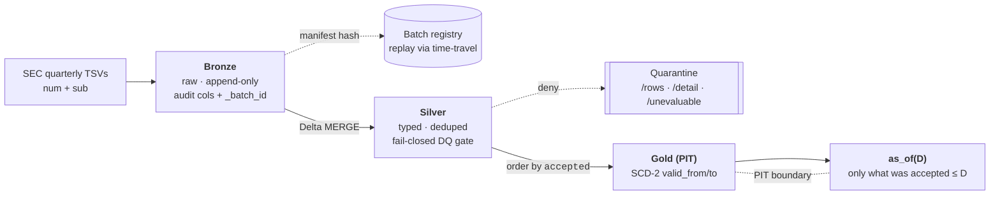

# The system — PIT boundary, guards, properties

State as of 2026-07-19. The identity summary lives in the [README](../README.md);
this page is the authoritative description of how the property is enforced.

## The load-bearing property

A query for *fundamentals as of date D* returns only what was **filed and accepted
on or before D** — no lookahead, including across restatements. A later correction
to a prior period never leaks backward into an as-of-D answer.

**Scope:** entity-level (consolidated, no-coregistrant) facts. Segment and
coregistrant breakouts are excluded by design at the silver layer and counted in run
metrics; within this scope the natural key `(adsh, tag, version, ddate, qtrs, uom)`
is unique — measured, not assumed, across every published FSDS quarter. Unique in 63
of 68 data-bearing quarters; five 2011–2012 quarters each carry 1–5 keys where the
same filing asserts **conflicting values**, and the DQ gate refuses those quarters
whole rather than silently picking a winner (see
[BACKFILL-METRICS.md](BACKFILL-METRICS.md)).

## Architecture

A three-layer medallion. The point-in-time boundary lives in the Gold layer, where
validity intervals are ordered strictly by the SEC `accepted` timestamp (ties fall
through to the data-derived pair `adsh, version` — a total order, never ingest order).
Gold is a **pure rebuild**: full silver joined to an accumulated filing index
(`SilverSubStore`, grown in lockstep with silver) — never a single batch's `sub`
slice, which would silently drop every previously ingested filing's facts.

All transforms are pure `(DataFrame) => DataFrame`, so they unit-test without a
cluster. Delta operations go through SQL (`MERGE INTO delta.`…``,
`DESCRIBE HISTORY` — `pit.util.DeltaIO`) and the DQ gate is plain DataFrame
aggregations, so one code path serves both runtimes (classic Spark locally, Spark
Connect on serverless Databricks — see [DEVELOPMENT.md](DEVELOPMENT.md)).

The session timezone is pinned to `America/New_York` in the entrypoints: SEC
`accepted` timestamps are US Eastern and zoneless, and parsing them in the machine's
local zone would move the PIT boundary across machines.

## Two guards

- **Content-addressed batch identity.** Each batch carries a `_batch_id` that is a
  SHA-256 over the source bytes **and** the schema version, code SHA, and ingest
  params — the input *and* the decision that produced the output. Every ingested
  quarter is recorded in a batch registry keyed by that hash, so any historical
  table state is reconstructable: identity is the hash, and Delta time-travel is the
  **retrieval** mechanism. (Retrieval, not byte-for-byte replay.)

- **Fail-closed-on-unevaluable DQ gate.** The gate denies not only when a constraint
  is *violated*, but when a constraint *cannot be evaluated* — a missing required
  column or empty input where rows are expected. A green result on an unevaluable
  check is the silent-verification failure mode the gate exists to prevent. Denied
  batches are quarantined to distinct lanes — `/rows` (structurally invalid),
  `/detail` (constraint failures), `/unevaluable` (missing column / empty) — never
  written to Silver.

## Provenance posture

**Tamper-evident, not signed.** Provenance stops at hash + Delta time-travel —
hash-anchored and replayable. There is no attestation layer, by deliberate choice:
the authority for "what was true as of D" is the external timestamp the SEC issues,
not a reviewer's signature.

## Properties under test

The guarantees are pinned by property tests, not prose:

| Property | Test |
|---|---|
| Byte change ⇒ new batch id; recorded Delta version retrieves the original rows | `BatchIdSpec` (§5) |
| Gate returns `Unevaluable` on missing column / empty input; `Fail` on a violation | `DataQualityGateSpec` (§6) |
| `as_of(D)` returns the original value for `T1 ≤ D < T2`, the restated value for `D ≥ T2` | `PitNoLookaheadSpec` (§7) |
| The Gold temporal model is order-invariant (ingest order cannot change the Gold table) | `PitNoLookaheadSpec` (§7) |
| Load-order independence at the tiebreak seam is tested with same-key restatements: an out-of-order correction through bronze→silver→gold changes no `as_of` answer; a committed control proves an ingest-ordered seam WOULD leak on the same fixture | `PipelineRestatementSpec` |
| An `accepted` tie resolves by the documented data-derived tiebreak (`accepted, adsh, version`), never arrival order | `PipelineRestatementSpec` |
| `uom` is part of the natural key: two units of one fact never collapse or restate each other | `PitNoLookaheadSpec`, `DataQualityGateSpec` |
| Segment/coregistrant rows are scoped out of silver and gold, and counted | `PipelineSpec`, `TsvIngestSpec` |
| Footnote-only rows (null `value`) quarantine to `/rows`; the batch still passes | `PipelineQuarantineSpec` |
| SEC-format TSV → bronze → silver → gold composes to the exact entity-level Gold; re-ingest is idempotent | `TsvIngestSpec` |
| Denied batches quarantine to distinct lanes without schema conflict | `PipelineQuarantineSpec` |

## Limits

- **Entity-level facts only** — segment and coregistrant breakouts are scoped out at
  silver (counted, not quarantined). Modeling them as first-class dimensions is future
  work, not a small extension: it changes the natural key.
- Quarterly batch ingest; no streaming.
- US-GAAP / XBRL scope; no IFRS or non-XBRL filers.
- Tamper-evident, not attested — provenance stops at hash + time-travel, by design.
- Maintenance ops are **named, not built**: `OPTIMIZE`/Z-ORDER/`VACUUM` and
  partition/cluster tuning appear in the spec's "at 100×" limits and remain future work.
  The full-history corpus is tens of GB; the deliverable is correctness plus honest ops
  metrics, nothing more.
